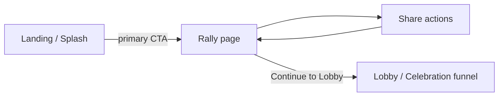

# Spec: Rally Page (Share-First Funnel)

## Purpose

Insert a **Rally** step between the landing page (Splash) and the Lobby / Celebration funnel. The page communicates that POWERBACK needs **people before money**, prioritizes sharing over account creation or donations, and ships **anonymous share links** in v1.

**Core message:** PEOPLE, NOT MONEY.

**In scope (v1):** Rally UI, navigation wiring, `ShareLink` model + APIs, rate limiting, GA events, minimal visit counters.

**Out of scope (v1):** Claim-code redemption (unless trivial), `User.referred_by_share_link`, per-visit metadata in MongoDB, full email-list backend (UI + analytics only if no existing endpoint fits).

---

## 1. Goal

### Strategic

- Shift the top-of-funnel from “enter the lobby / donate” to “spread the word first.”
- Make sharing the **primary** CTA; account creation and Celebration remain **secondary**.
- Collect rally interest via optional email signup without blocking exploration.

### Product

- Every **new or unauthenticated** visitor who proceeds past Splash via the primary CTA sees Rally before Lobby (logged-in users are not forced through Rally; see §2 Navigation).
- Visitors can leave Rally via share actions, email signup, or an explicit continue into the existing guest Lobby flow.
- Anonymous share links are generated server-side, visited via a stable public URL, and attributed on `ShareLink` (not on `User`).

### Technical (v1)

- New frontend page: `client/src/pages/Rally/`.
- Navigation: Splash primary CTA → Rally; Rally “Continue” → existing `Tour` → funnel (`pol-donation`, guest access).
- Backend: `ShareLink` Mongoose model, `POST` create + `GET` visit-by-public-code, IP rate limit on create.
- Frontend: show stored link from `pb:shareLink` when present; call `POST /api/share-links` only after an explicit generate click (never on Rally mount).

---

## 2. User flow

### Default path (share-first funnel)



1. **Landing (Splash)** — Visitor reads mission / explainer; primary CTA for unauthenticated visitors goes to Rally instead of straight into the funnel.
2. **Rally** — Visitor sees PEOPLE, NOT MONEY and four parallel paths (below).
3. **Lobby / Celebration** — Only after explicit “Continue to Lobby” (today’s `Tour` → `navigateToFunnel('pol-donation', 0)` + `guestAccessGranted` behavior).

### Rally choices (non-exclusive)

| #   | Action                            | Behavior                                                                                                                     |
| --- | --------------------------------- | ---------------------------------------------------------------------------------------------------------------------------- |
| 1   | **Share manually**                | Copy / Web Share API for site URL or suggested message; no server write required.                                            |
| 2   | **Generate anonymous share link** | Reuse stored link if present; otherwise create only after explicit generate click; then show URL + claim code copy controls. |
| 3   | **Join email updates**            | Email capture UI; submit if/when backend exists; do not block other paths.                                                   |
| 4   | **Continue to Lobby**             | Same guest entry as current Splash `Tour` path (`pb:guestAccess`, funnel step 0).                                            |

### Share link inbound path

1. Recipient opens share URL (see §5).
2. Client records `share_link_visited` (GA) and calls visit API.
3. Server increments `visit_count`, updates `first_visit_at` / `last_visit_at` only.
4. Recipient may land on Splash or Rally with share context in session (no PII in MongoDB).

### Navigation / history (align with `specs/navigation-system.md`)

- Add Rally to splash navigation state (e.g. extend `LandingNavView` with `'Rally'` or dedicated `navContext`—implementation choice).
- Splash primary CTA (guest / unauthenticated path): `navigateToSplashView('Rally')` (or equivalent), **not** `'Tour'`. Logged-in Splash CTA may still open Rally optionally but must not be the only path to the funnel.
- Rally continue: `navigateToSplashView('Tour')` (preserves existing guest-access + funnel transition in `NavigationContext.tsx`).
- Back from Rally → Splash landing (`''`).
- Popstate / `pb:guestAccess` rules unchanged: funnel still requires legitimate guest access via Rally continue (or logged-in user).

**Authenticated users — Rally is not an auth gate**

Rally is **not** an authentication gate and must not block normal app use for signed-in visitors.

- If the user already has a valid logged-in session, or refresh-token restoration succeeds on load, **existing navigation must keep working** without forcing Rally first.
- **Do not redirect** to Rally solely because Rally exists when the user navigates directly to Lobby, account, funnel steps, or other established routes (deep links, nav controls, history restore).
- Rally applies **primarily** to the **public Splash primary CTA** path for **new or unauthenticated** visitors (Splash → Rally → optional share → Continue to Lobby).
- Logged-in users **may** open Rally voluntarily (Rally link in nav/footer, share CTA, or Splash CTA), but must not be **trapped** on Rally or **required** to pass through it before using Lobby, Celebrations, or account features.
- Implementations should branch on `isLoggedIn` / auth initialization: mandatory Rally insertion targets the guest funnel entry, not every route change.

### Session / storage keys (frontend)

| Key              | Purpose                                                                                                                                                            |
| ---------------- | ------------------------------------------------------------------------------------------------------------------------------------------------------------------ |
| `pb:shareLink`   | `{ publicCode, claimCode }` — set only after successful explicit generate; read on mount to restore UI; never triggers POST by itself; TTL optional (e.g. 30 days) |
| `pb:guestAccess` | Unchanged; set when continuing to Lobby                                                                                                                            |
| `pb:rallySeen`   | Optional; suppress duplicate `rally_page_seen` in same session                                                                                                     |

Do **not** add `User.referred_by_share_link` in v1. When a referred user registers later, append their `User` `_id` to `ShareLink.referred_users` via a separate attribution hook (deferred unless trivial at signup).

---

## 3. UI sections

New page module: `client/src/pages/Rally/` (Tier 1 header, co-located `style.css`, copy in `client/src/constants/copy/rally.ts`).

**Copy status:** Rally page copy is still WIP. The wording suggested in this spec is **directional**, not final. During implementation, Cursor (or any author) may improve or replace suggested lines when a broader read of the POWERBACK codebase—existing copy registries, Splash copy, FAQ language, compliance language, or navigation patterns—points to clearer or more consistent phrasing. Strategic intent is fixed: **PEOPLE, NOT MONEY**; sharing is primary; account creation and Celebrations are secondary; tone stays serious, lawful, movement-oriented, and non-transactional.

### Section A — Hero / core message

- Headline: **PEOPLE, NOT MONEY.**
- Subcopy: POWERBACK needs reach and volunteers before donations; sharing counts as participation.
- Visual hierarchy: message largest; secondary actions visually subordinate.

### Section B — Share manually (primary)

- Short instruction: share with anyone who might care (friends, groups, local orgs).
- Actions:
  - **Copy site link** (origin + `/` or canonical marketing URL).
  - **Copy suggested message** (includes link; no PII).
  - **Native share** when `navigator.share` is available.
- Fire `rally_manual_share_seen` when section enters view (or on first interaction—pick one and document in implementation).

### Section C — Anonymous share link (primary)

- Explain: anonymous link tracks how many people opened it; optional claim code for future rewards (wording must not promise recovery if lost).
- **No auto-create on mount:** Rally must **not** call `POST /api/share-links` when the page loads. Passive visitors who only read Rally or continue to Lobby must not create `ShareLink` documents.
- **Generate / show link:**
  - **On mount, if `pb:shareLink` exists:** show the stored public URL and claim-code controls (e.g. masked claim code with “reveal” toggle). Do not POST.
  - **On mount, if `pb:shareLink` does not exist:** show a **Generate anonymous share link** button only (plus explanatory copy). Do not POST.
  - **On explicit generate click:** call `POST /api/share-links` once; on success persist `{ publicCode, claimCode, shareUrl }` to `pb:shareLink` and reveal copy controls.
- **After link exists** (stored or just created):
  - Public URL (readonly input + copy).
  - Private claim code (shown once on first create; warn that loss is permanent).
- Buttons: Generate (when no stored link); Copy link → `share_link_copied`; Copy claim code (optional separate event or param on same event).
- Errors: rate limit → user-friendly message; do not retry in a tight loop.

### Section D — Email updates (secondary)

- Single email field + submit; minimal friction (no full account form).
- `rally_email_signup_started` on focus or submit start.
- v1: wire to existing comms/contact pattern if available; otherwise UI-only + TODO endpoint (see §9).

### Section E — Continue to Lobby (secondary)

- Button label along lines of “Continue to Lobby” / “Explore the Lobby” (match `SPLASH_COPY` tone).
- Subtext: no payment or signup required to explore (reuse Splash disclaimer spirit).
- On click: `rally_continue_to_lobby_click` → `navigateToSplashView('Tour')`.

### Section F — Account / Celebration (tertiary)

- De-emphasized links: “Create account” / “Sign in” open existing credentials modal (`Join Now` / `Sign In` patterns from `Logio`).
- No donation CTA on Rally.

### Responsive / a11y

- Follow `specs/frontend-ui.md`: keyboard-accessible controls, visible focus, no hover-only affordances.
- CSS classes: `rally--*` block naming per project convention (`24-css-class-naming.mdc`).

---

## 4. Backend model

### `ShareLink` (`models/ShareLink.js`)

| Field             | Type         | Required | Notes                                                              |
| ----------------- | ------------ | -------- | ------------------------------------------------------------------ |
| `public_code`     | `String`     | yes      | Unique, indexed; URL-safe opaque id (e.g. 12–16 chars from CSPRNG) |
| `claim_code_hash` | `String`     | yes      | bcrypt hash of private claim code; never store plaintext           |
| `visit_count`     | `Number`     | yes      | Default `0`                                                        |
| `first_visit_at`  | `Date`       | no       | Set on first successful visit increment                            |
| `last_visit_at`   | `Date`       | no       | Updated on each visit                                              |
| `referred_users`  | `[ObjectId]` | no       | `ref: 'User'`; default `[]`; append on attributed signup (later)   |
| `claimed_by_user` | `ObjectId`   | no       | `ref: 'User'`; v1 unused                                           |
| `claimed_at`      | `Date`       | no       | v1 unused                                                          |

**Indexes:** unique on `public_code`.

**Timestamps:** `timestamps: true` (`createdAt`, `updatedAt`) for ops; not a substitute for visit fields.

**Claim code generation (create time only):**

1. Generate `claim_code` (high entropy, e.g. 24+ chars or formatted segments).
2. Return `claim_code` once in API response body.
3. Persist `claim_code_hash` via bcrypt (`SERVER.SALT_WORK_FACTOR` or dedicated cost).
4. If visitor loses `claim_code`, POWERBACK cannot recover it (document in UI).

Export from `models/index.js`.

---

## 5. API endpoints

### Public share URL vs internal API

| What                                     | URL / path                                 | Who uses it                                      |
| ---------------------------------------- | ------------------------------------------ | ------------------------------------------------ |
| **Public share URL** (share with others) | `https://powerback.us/?share={publicCode}` | Visitors, copy/share UI, SMS, social             |
| **Visit API** (internal)                 | `GET /api/share-links/:publicCode`         | Frontend only, after detecting `?share=` on load |

Users must **never** be asked to copy or share the API path (`/api/share-links/...`). Copy targets and Web Share payloads use the **public** URL only. The frontend parses `?share={publicCode}`, then calls the visit API server-side (via `API.ts`); recipients never interact with the API URL directly.

Mount new router at `/api/share-links` in `routes/api/index.js`.

All responses use existing error envelope: `{ error: { message, status } }`.

### `POST /api/share-links`

Create a new anonymous share link.

- **Auth:** none (public).
- **Rate limit:** dedicated limiter by IP (§6).
- **Body:** empty or `{}` for v1.
- **Success `201`:**

```json
{
  "publicCode": "abc123xyz",
  "shareUrl": "https://powerback.us/?share=abc123xyz",
  "claimCode": "one-time-plaintext-claim-code"
}
```

- **Logic:** generate `public_code` + `claim_code`; hash claim code; insert `ShareLink`.
- **Idempotency:** not server-side in v1; client avoids duplicate creates by persisting `pb:shareLink` after the first successful explicit generate (no POST on Rally mount).

### `GET /api/share-links/:publicCode`

Record a visit. **Internal endpoint only**—not a shareable link. Called by the app when it loads with `?share={publicCode}` in the location (see **Share URL shape** below).

- **Auth:** none.
- **Rate limit:** `rateLimiters.general` or light per-IP cap (prevent scan/enumeration).
- **Success `200`:**

```json
{
  "publicCode": "abc123xyz",
  "visitCount": 3
}
```

- **Logic:** find by `public_code`; if missing → `404`; else atomically increment `visit_count`, set `first_visit_at` if null, set `last_visit_at` to now.
- **Privacy:** do not accept or store IP, UA, referrer, or geo in MongoDB.

### `POST /api/share-links/:publicCode/claim` (deferred)

Redeem `claim_code` for authenticated user; set `claimed_by_user`, `claimed_at`. **TODO v1** unless trivial.

### Validation

- Joi schema: `publicCode` param alphanumeric length bounds matching generator.
- No request body fields that embed PII for v1.

### Frontend API client

Add methods to `client/src/api/API.ts` (only gateway for HTTP). Types in `client/src/interfaces` or co-located API types.

### Share URL shape

- **Public URL to share (v1):** `https://powerback.us/?share={publicCode}` — canonical form returned as `shareUrl` from `POST /api/share-links` and shown in Rally copy/share controls.
- **App route:** same query param on main route (`/?share={publicCode}`; works with existing `routes.main()`).
- **Visit recording:** on bootstrap, if `share` query param is present, frontend calls `GET /api/share-links/:publicCode` once per session (e.g. `sessionStorage` flag `pb:shareVisit:{publicCode}`), then strip or retain the query param per UX choice. Do not expose the API URL in UI or share sheets.

---

## 6. Rate limiting

Use `express-rate-limit` via `services/utils/rateLimitHelpers.js` (`createRateLimiter` + localhost skip in non-production).

### New limiter: `shareLinkCreate`

Add to `rateLimiters` export:

| Setting    | Suggested value                                       |
| ---------- | ----------------------------------------------------- |
| `windowMs` | 1 hour                                                |
| `max`      | 10 per IP                                             |
| `message`  | Too many share links created. Please try again later. |

Apply to `POST /api/share-links` only.

### Visit endpoint

- Stricter than general API if abuse appears; start with `general` (100 / 15 min) or a dedicated `shareLinkVisit` (e.g. 60 / 15 min per IP).
- Do not rate-limit so aggressively that legitimate viral traffic looks like errors on the recipient side.

### Frontend abuse prevention

- Never POST on Rally mount; only on explicit generate click.
- Reuse `pb:shareLink` when present (skip POST).
- Disable generate button while request in flight.
- On `429`, show limit message; keep existing stored link if any.

---

## 7. Analytics events

Use `trackGoogleAnalyticsEvent` from `@Utils` (see `.cursor/skills/powerback-ga-instrumentation/SKILL.md`). Stable snake_case event names; params must stay coarse-grained.

**Do not send to GA:** `public_code`, `publicCode`, `claimCode`, email addresses, full share URLs, or any other share-link identifier. Visit and funnel reporting use booleans/enums only (see `share_link_visited`).

| Event                           | When                                                                                | Suggested params                             |
| ------------------------------- | ----------------------------------------------------------------------------------- | -------------------------------------------- |
| `rally_page_seen`               | Rally mount (once per session)                                                      | `entry: splash \| share`                     |
| `rally_manual_share_seen`       | Manual share section visible or first expand                                        | —                                            |
| `share_link_generated`          | Successful POST after explicit generate click (not mount, not restore from storage) | —                                            |
| `share_link_copied`             | User copies public URL or claim code                                                | `target: url \| claim` (enum only)           |
| `share_link_visited`            | Visit API success (inbound share)                                                   | `has_share_param: true`, `entry: share_link` |
| `rally_email_signup_started`    | Email field focus or submit                                                         | —                                            |
| `rally_continue_to_lobby_click` | Continue CTA click                                                                  | —                                            |

**GA4 follow-up:** register custom dimensions in GA admin if new params are added (document in PR).

**Server:** no GA from API in v1; visit counts live in MongoDB + client event.

---

## 8. Privacy constraints

### MongoDB (ShareLink)

- **Store:** `visit_count`, `first_visit_at`, `last_visit_at` only for visit analytics.
- **Do not store:** IP, user agent, referrer, country, device id, or per-visit documents.
- **Do not log:** claim codes, claim code plaintext, or email addresses in server logs (hashes OK for debug only if needed).

### Client storage

- `pb:shareLink` may hold `claimCode` for same-device convenience; not synced server-side.
- Clear `pb:shareLink` on explicit user “reset link” action if offered (optional v1).
- Follow `20-client-storage.mdc`: prefixed keys, JSON, size/TTL discipline.

### Claim code

- One-time display on create; hash-only at rest.
- No recovery flow in v1; UI must state this clearly.

### Email signup

- If persisted later, use existing email/comms patterns with consent copy; do not merge into `ShareLink` without spec update.

### GA

- Richer funnels (scroll, time on page, campaigns) via GA only, not MongoDB visit logs.

---

## 9. Deferred items

| Item                                       | Notes                                                                                   |
| ------------------------------------------ | --------------------------------------------------------------------------------------- |
| `POST .../claim`                           | Redeem claim code; set `claimed_by_user`, `claimed_at`                                  |
| `User.referred_by_share_link`              | Attribution stays on `ShareLink.referred_users`                                         |
| Signup attribution hook                    | On `User` create, if `?share=` or session flag present, `$addToSet` on `referred_users` |
| Email updates backend                      | Dedicated waitlist model or `Applicant`-lite + double opt-in                            |
| Server-side idempotent create              | e.g. fingerprint cookie (privacy review required)                                       |
| Share link admin / revoke                  | Ops tooling                                                                             |
| Rewards / gamification tied to claim codes | Product follow-on                                                                       |
| Dedicated route `/#/rally/:code`           | Optional prettier URLs                                                                  |
| Docs: `docs/API.md`                        | Update when endpoints ship                                                              |

---

## 10. Acceptance criteria

### Funnel / UX

- [ ] Splash primary CTA navigates unauthenticated visitors to Rally, not directly into the funnel.
- [ ] Rally displays **PEOPLE, NOT MONEY** as the dominant message.
- [ ] All four Rally paths are available without completing the others.
- [ ] “Continue to Lobby” enters the same guest funnel as pre-Rally `Tour` (Lobby at `pol-donation`, guest access flag set).
- [ ] Account/sign-in remain available but visually secondary to share actions.

### Share links (v1 backend)

- [ ] `ShareLink` model exists with fields in §4; exported from `models/index.js`.
- [ ] `POST /api/share-links` returns `publicCode`, `shareUrl`, `claimCode` once; stores only `claim_code_hash`.
- [ ] `GET /api/share-links/:publicCode` increments visit counters and returns `404` for unknown codes.
- [ ] No per-visit metadata documents or IP fields on `ShareLink`.
- [ ] Create endpoint rate-limited by IP via `rateLimitHelpers`.
- [ ] Rally does **not** call `POST /api/share-links` on mount when `pb:shareLink` is absent.
- [ ] Generate button is shown when no stored link; POST runs only after explicit click.
- [ ] After successful create, response is persisted to `pb:shareLink`; revisits show stored link without another POST.

### Inbound share

- [ ] `/?share={publicCode}` triggers visit API once per session and fires `share_link_visited`.
- [ ] Recipient can use the app without creating a link or account.

### Analytics

- [ ] All seven events in §7 are implemented at the specified trigger points.
- [ ] No PII or share-link identifiers in GA params (`public_code`, `claimCode`, emails, full share URLs forbidden per §7).

### Privacy / security

- [ ] Lost claim code cannot be recovered via API or support tooling in v1.
- [ ] Server logs do not contain plaintext claim codes.
- [ ] `User` schema unchanged (no `referred_by_share_link`).

### Regression

- [ ] Logged-in users (or successful session restore) reach Lobby, account, and funnel without being redirected to Rally.
- [ ] Direct Lobby, account, or funnel navigation is not hijacked to Rally only because Rally was added.
- [ ] Splash primary CTA → Rally applies to the public guest path; logged-in users may visit Rally voluntarily but are not trapped there.
- [ ] Navigation popstate / `pb:guestAccess` behavior matches `specs/navigation-system.md` after Rally insertion.
- [ ] ESLint passes on touched client files; API routes follow `05-api-patterns.mdc`.

---

## Implementation references

| Area          | Location                                                             |
| ------------- | -------------------------------------------------------------------- |
| Splash CTA    | `client/src/pages/Splash/Splash.tsx`                                 |
| Tour → funnel | `client/src/contexts/NavigationContext.tsx` (`navigateToSplashView`) |
| Guest access  | `specs/navigation-system.md`, `pb:guestAccess`                       |
| Rate limiters | `services/utils/rateLimitHelpers.js`                                 |
| API mount     | `routes/api/index.js`                                                |
| GA helper     | `client/src/utils/analytics/analytics.ts`                            |
| Models index  | `models/index.js`                                                    |

---

## Changelog

| Date       | Change                                                                          |
| ---------- | ------------------------------------------------------------------------------- |
| 2026-05-21 | Initial spec (share-first funnel, ShareLink v1)                                 |
| 2026-05-21 | Clarify public share URL vs API; GA identifier prohibition; Rally copy WIP note |
| 2026-05-21 | ShareLink create on explicit generate click only (no POST on Rally mount)       |
| 2026-05-21 | Rally not an auth gate; no forced Rally for logged-in or direct app navigation  |
